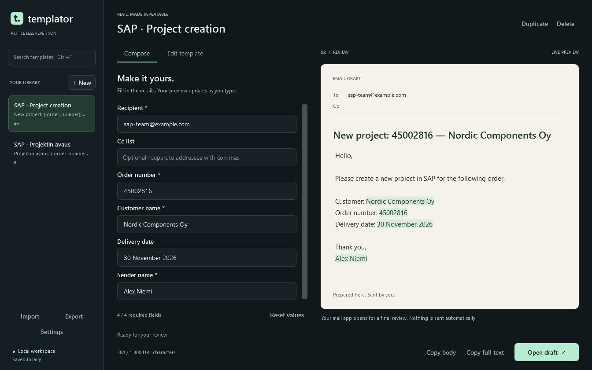

# Templator

**A little less repetition.** A local Windows workspace for emails you write
again and again. Fill the details, review the message, and open a draft in your
own mail app.



Built independently from the product brief in this repository. C# / .NET 10,
native WPF, no third-party runtime packages. No AI service, account, telemetry,
or network calls. Templator **never sends mail**.

## Start

Windows 10/11 x64 with the [.NET 10 Desktop Runtime](https://dotnet.microsoft.com/en-us/download/dotnet/10.0).
Extract the portable ZIP and run `Templator.exe`; no installer or administrator
rights needed. The optional standalone build includes the runtime.

Build from source with the .NET 10 SDK:

```powershell
dotnet run --project src/Templator
```

## Use

1. Choose the English or Finnish SAP starter, or create a template.
2. In **Compose**, fill the required fields. Values are remembered per template.
3. Review the paper preview, then choose **Open draft**. Review again in Outlook
   or your default mail app and send there yourself.

**Edit template** changes the name, language, recipients, subject, and message.
Type `{{customer_name}}` in any message field to create a variable. Customize
its label, example hint, and required flag below the source editor. Keys are
case-sensitive letters, digits, and underscores. The language setting is
metadata; it does not translate your text. The interface is in English.

To and Cc accept literal addresses or variables. Use plain email addresses,
separated by commas or semicolons. Display names and internationalized email
addresses are not supported; message content supports full Unicode.

- **Duplicate** makes an independent copy, including remembered values.
- **Reset values** clears the selected template's saved input after confirmation.
- Right-click a library item to move it up/down, duplicate, or delete it.
- **Import** adds copies from a backup without replacing existing templates or
  settings. **Export** backs up the entire library, including saved values.
- **Settings** provides recipient defaults for new templates and a configurable
  long-draft warning threshold.

| Shortcut | Action |
| --- | --- |
| Ctrl+F | Search library |
| Ctrl+N | New template |
| Ctrl+S | Save now / retry failed save |
| Ctrl+Enter | Open a valid draft |

For long messages, choose **Copy body + open draft**, save an **.eml draft**, or
explicitly open the full link anyway. Copy body/full text also work independently.
Mail clients have different link limits and `.eml` editing behavior; the threshold
is advisory. The clipboard fallback is usually the most predictable choice.

## Local data and recovery

Data is stored at `%APPDATA%\Templator-GPT`, separate from any older Templator
installation. This app never reads that older folder automatically.

- `templates.json`: templates, definitions, values, and settings.
- `templates.json.bak`: previous successful save, retained during atomic replacement.
- `templates.json.bad-<timestamp>`: original malformed file preserved for recovery.
- `window-state.json`: window bounds. Invalid/off-screen bounds are ignored.
- `crash.log`: last-chance exception diagnostics, if needed.
- `store.lock`: prevents simultaneous writers; the empty file may remain after exit.

Edits save after a short pause. The sidebar distinguishes saving, saved, and
failed states. If saving fails, work stays in memory; retry with Ctrl+S or export
it before closing. The app asks before discarding unsaved changes.

To recover, use **Import** and select `templates.json.bak` or another exported
backup. Import always creates copies. For exact restoration, close the app, copy
your backup over `templates.json`, then reopen it. Future schema versions are
left untouched and require a compatible app.

Templates and values are plain local JSON, not encrypted. Exported files and
clipboard contents can contain business information. There is no runtime
networking in Templator; your chosen mail app handles its own connections.

For a separate workspace or testing:

```powershell
$env:TEMPLATOR_DATA_DIR = "$PWD\scratch-workspace"
dotnet run --project src/Templator
```

## Verify and package

```powershell
./scripts/Verify.ps1
./scripts/Publish.ps1                 # single EXE; Desktop Runtime required
./scripts/Publish.ps1 -SelfContained  # includes Microsoft's Windows runtime
```

The normal build uses installed SDK/reference packs and no external packages.
The standalone publish may download Microsoft runtime packs from NuGet.
ZIPs appear in `artifacts`. GitHub Actions verifies the app on Windows and
publishes a portable build artifact for each successful main-branch run.

Tests use isolated temporary workspaces and a fake mail/clipboard platform.
They do not open Outlook, send mail, or touch your normal data. UI tests create
real WPF windows off-screen and render PNGs under `artifacts/ui` for inspection.

## Project map

| Location | Responsibility |
| --- | --- |
| `src/Templator.Core` | Store, variable lifecycle, rendering, URI/MIME generation |
| `src/Templator` | WPF interface, presentation state, Windows integration |
| `tests/Templator.Tests` | Core regression suite |
| `tests/Templator.UiTests` | Actual WPF bindings, lifecycle, dialogs, and renders |
| `docs/DESIGN.md` | Product contract and design decisions |
| `docs/VERIFICATION.md` | Verification evidence and manual release checks |

The app is deliberately small: no Outlook COM dependency, HTML email, Bcc,
attachments, cloud sync, automatic updates, or automatic sending.
